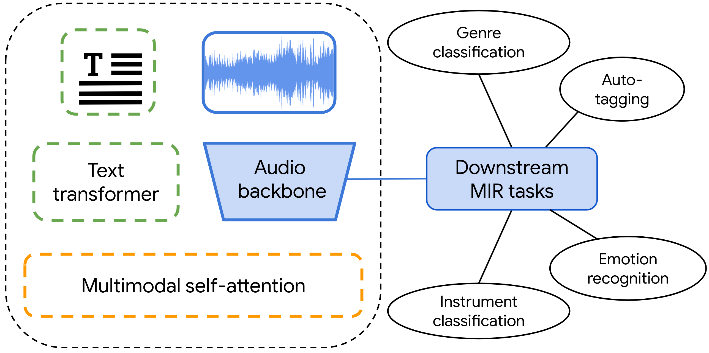

<div  align="center">

# Learning Music Audio Representations Via Weak Language Supervision
[Ilaria Manco](https://ilariamanco.com/)<sup>1</sup> <sup>2</sup>,
[Emmanouil Benetos](http://www.eecs.qmul.ac.uk/~emmanouilb/)<sup>1</sup>,
[Elio Quinton](https://scholar.google.com/citations?user=IaciybgAAAAJ)<sup>2</sup>,
[Gyorgy Fazekas](http://www.eecs.qmul.ac.uk/~gyorgyf/about.html)<sup>1</sup> <br>
<sup>1</sup>  Queen Mary University of London, <sup>2</sup>  Universal Music Group

[](https://www.gnu.org/licenses/gpl-3.0)
[](https://arxiv.org/abs/2112.04214)

<p align="center">

</p align="center">

</div>

This repository is the official implementation of ["Learning Music Audio Representations Via Weak Language Supervision"](https://arxiv.org/abs/2112.04214) (ICASSP 2022).

In this work we present **MuLaP**, a framework for **mu**sic-and-**la**nguage **p**re-training to learn general-purpose music audio representations. MuLaP allows an audio backbone to learn from weakly aligned natural language descriptions of the audio content via a multimodal co-attention Transformer module. This audio-linguistic pre-training endows the model with good transfer learning capabilities, resulting in representations that are useful for a variety of music classification and regression downstream tasks. 

We provide code for pre-training, downstream training and evaluation of MuLaP on 4 tasks: music auto-tagging, genre classification, instrument recognition and emotion recognition. 

## Installation

Clone the repository and install the dependencies. We recommend using a fresh virtual environment.
```setup
git clone https://www.github.com/ilaria-manco/mulap 
cd mulap 
pip install -r requirements.txt
pip install -e .
```

## Preparing the dataset
MuLaP is pre-trained on a multimodal dataset of (audio, text) pairs. 

Annotations should be provided in JSON format and must include the following fields:

```audio_id```:     the unique identifier for each audio track in the dataset

```caption``` :     a string with the textual description of the audio track 

```audio_path```:   path to the audio track, relative to the root audio directory

One JSON file per split must be provided and stored in the [`data/datasets`](data/datasets/) directory, following this structure:

```
dataset_name
├── audio            
│   ├── track_1.npy
│   ├── track_2.npy
|   └── ...
├── dataset_train.json    
├── dataset_val.json    
└── dataset_test.json
```

An illustrative example of the dataset is provided in [`data/datasets/audiocaption/`](data/datasets/audiocaption/).

## Pre-training MuLaP
Dataset, model and training configurations are set in the respective `yaml` files in [`configs`](configs). You can also pass some options via the CLI, overwriting the arguments in the config files. For more details on the CLI options, you can refer to the [training script](mulap/scripts/pretrain.py).

To pre-train the model with the default configs, simply run

```bash
cd mulap/scripts/
python pretrain.py 
```

This will generate an `pretrain_id` and create a new folder in [`save/experiments/`](save/experiments/) where the output will be saved.

If you wish to resume pre-training from a saved checkpoint, run this command:

```train
python pretrain.py --pretrain_id <pretrain_id> 
```

## Transferring MuLaP to downstream tasks
After pre-training, you can train a classifier on top of the audio backbone for one of the four downstream tasks by running

```bash
cd mulap/scripts/
python downstream.py <pretrain_id> <downstream_task>
```

The downstream tasks supported are:
* `jamendo_tagging`: auto-tagging on the [MTG-Jamendo Dataset](https://github.com/MTG/mtg-jamendo-dataset)
* `mtt_tagging`: auto-tagging on the [MagnaTagATune Dataset](https://mirg.city.ac.uk/codeapps/the-magnatagatune-dataset)
* `emomusic_reg`: music emotion recognition on the [Emomusic dataset](https://cvml.unige.ch/databases/emoMusic/)
* `fma_clf`: music genre classification on the [FMA-small dataset](https://github.com/mdeff/fma)
* `nsynth_clf`: instrument classification on the [NSynth dataset](https://magenta.tensorflow.org/datasets/nsynth)

You'll need to download the datasets inside the [`datasets/`](datasets/) folder and preprocess them before running downstream training. Dataset, model and training configurations for each task are set in the respective `yaml` files in [`configs/downstream`](configs/downstream/).

## Evaluating downstream performance

After downstream training, you can run the evaluation as follows:

```eval
cd <project_name>/scripts/
python eval.py <pretrain_id> <downstream_id> 
```

## Cite
If you use the code in this repo, please consider citing our work:

```bib
@inproceedings{manco2022learning,
  title={Learning Music Audio Representations Via Weak Language Supervision}, 
  author={Manco, Ilaria and Benetos, Emmanouil and Quinton, Elio and Fazekas, György},
  booktitle={ICASSP 2022 - 2022 IEEE International Conference on Acoustics, Speech and Signal Processing (ICASSP)}, 
  year={2022},
  pages={456-460},
  doi={10.1109/ICASSP43922.2022.9746996}
}
```

## License
This repository is released under the GNU General Public License v3.0 license. Please see the [LICENSE](LICENSE) file for more details.

Some of the code is adapted from the following repos: 
* [sota-music-tagging-models](https://github.com/minzwon/sota-music-tagging-models) by [@minzwon](https://github.com/minzwon)
* [jukemir](https://github.com/p-lambda/jukemir/) by [p-lambda](https://github.com/p-lambda/)
* [vilbert](https://github.com/facebookresearch/vilbert-multi-task/) by [@facebookresearch](https://github.com/facebookresearch)
* [transformers](https://github.com/huggingface/transformers) by [@huggingface](https://github.com/huggingface)

## Contact
If you have any questions, please get in touch: [i.manco@qmul.ac.uk](i.manco@qmul.ac.uk).
